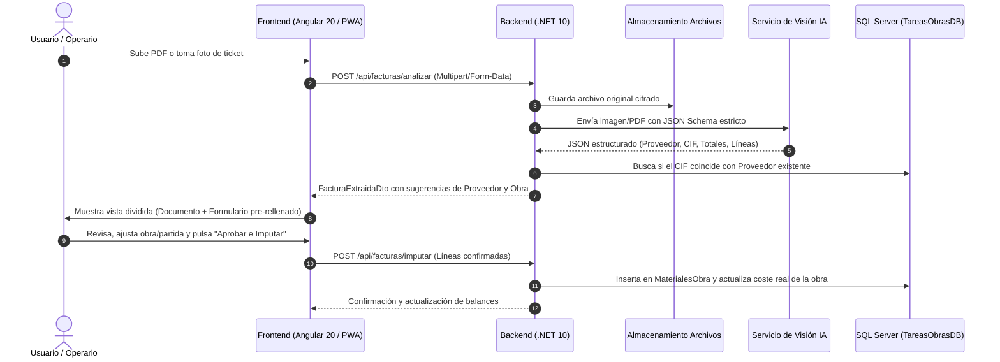

# Plan de Implementación: Contabilización e Imputación de Facturas y Tickets con IA

## 1. Visión y Objetivo
Automatizar la contabilización de gastos y materiales en las obras mediante el procesamiento inteligente de **facturas en PDF, albaranes escaneados y fotos de tickets de compra** tomadas desde el smartphone o subidas desde el panel de gestión.

El objetivo es sustituir el tecleo manual por un proceso de **extracción asistida por IA en 3 segundos con validación en 1 clic (*Human-in-the-Loop*)**, imputando directamente los costes a la obra y partida de presupuesto correspondiente y guardando el justificante digital para auditorías.

---

## 2. Flujo de Trabajo (Workflow Funcional)



---

## 3. Comparativa y Decisión Tecnológica de IA

| Criterio | Opción A: **LLM Visión Multimodal (Recomendada: Gemini 2.0 Flash / GPT-4o mini)** | Opción B: **Azure AI Document Intelligence** | Opción C: **OCR Tradicional (Tesseract / IronOCR)** |
| :--- | :--- | :--- | :--- |
| **Precisión en tickets arrugados / de campo** | 🟢 **Excelente (98%)**: comprende formatos rotos, manchas, abreviaturas de construcción | 🟡 **Buena en A4**: más rígido ante tickets térmicos degradados de ferretería | 🔴 **Muy deficiente**: falla al menor pliegue o sombra |
| **Salida estructurada** | 🟢 **Nativa (`Structured Outputs / JSON Schema`)**: entrega directamente el objeto C# deserializado | 🟡 Requiere mapear la respuesta del SDK de Azure | 🔴 Exige programar complejas expresiones regulares (RegEx) |
| **Velocidad de respuesta** | ⚡ 1.5 - 3.0 segundos | ⏱️ 3.0 - 5.0 segundos | ⚡ 1.0 segundo |
| **Coste por documento** | 💰 **~0,001 € - 0,002 €** por factura/ticket | 💰 ~0,015 € por factura | 💰 0 € (consumo de CPU local) |
| **Complejidad de integración** | 🟢 Muy simple: llamada HTTP estándar autenticada por API Key | 🟡 Media: aprovisionamiento de recurso en Azure | 🔴 Muy alta: mantenimiento continuo de plantillas |

> **Decisión:** Utilizar **Gemini Flash (o GPT-4o mini)** mediante API de Visión Multimodal con esquema JSON tipado garantizado (`response_schema`), ofreciendo máxima tolerancia a tickets de ferretería y albaranes de almacén a un coste prácticamente nulo.

---

## 4. Adaptaciones en el Backend (.NET 10)

### 4.1. Extensiones en el Modelo de Dominio (`TareasObras.Domain`)
En la entidad `MaterialObra` (o nueva entidad `GastoFactura` si se desea agrupar cabecera y líneas):
* `public string? DocumentoAdjuntoUrl { get; private set; }`: Ruta relativa o URL segura del archivo PDF/imagen.
* `public string? DocumentoHash { get; private set; }`: Hash SHA256 para evitar duplicar la misma factura accidentalmente.
* `public string? CifProveedor { get; private set; }`: CIF/NIF extraído.
* `public decimal? ImporteIva { get; private set; }`: IVA desglosado.
* `public decimal? BaseImponible { get; private set; }`: Base imponible.

### 4.2. Definición de DTOs de Extracción
```csharp
public record FacturaExtraidaDto
{
    public string? ProveedorNombre { get; init; }
    public string? ProveedorCif { get; init; }
    public Guid? ProveedorIdSugerido { get; init; }
    public string? NumeroFactura { get; init; }
    public string? NumeroAlbaran { get; init; }
    public DateTime? FechaEmision { get; init; }
    public decimal BaseImponible { get; init; }
    public decimal PorcentajeIva { get; init; }
    public decimal ImporteIva { get; init; }
    public decimal ImporteTotal { get; init; }
    public string? ObraIdentificadaTexto { get; init; }
    public Guid? ObraIdSugerida { get; init; }
    public string DocumentoTemporalUrl { get; init; } = "";
    public List<LineaMaterialExtraidaDto> Lineas { get; init; } = new();
}

public record LineaMaterialExtraidaDto
{
    public string Descripcion { get; init; } = "";
    public string Unidad { get; init; } = "ud";
    public decimal Cantidad { get; init; }
    public decimal PrecioUnitario { get; init; }
    public decimal Importe { get; init; }
    public Guid? LineaPartidaIdSugerida { get; init; }
}
```

### 4.3. Servicios de Infraestructura
1. **`IFileStorageService`:**
   * Almacenamiento local en `/uploads/facturas/{año}/{mes}/` o Azure Blob Storage.
   * Generación de miniaturas (*thumbnails*) para carga ultrarrápida.
2. **`IFacturaOcrService`:**
   * Recibe el `Stream` del archivo (PDF o Imagen).
   * Convierte la primera página del PDF a imagen si es necesario o envía el archivo directo al modelo multimodal.
   * Aplica el esquema JSON estricto y cruza los datos con la base de datos de `Proveedores` y `Obras` existentes para preseleccionar identificadores.

### 4.4. Endpoints de la API (`FacturasController`)
* `POST /api/facturas/analizar`: Procesa el archivo y retorna `FacturaExtraidaDto`.
* `POST /api/facturas/imputar`: Recibe el DTO verificado por el usuario, crea los registros en `MaterialesObra`, descuenta del presupuesto de la obra y mueve el archivo a la carpeta definitiva.
* `GET /api/facturas/documento/{materialId}`: Descarga o previsualiza de forma segura el justificante asociado a un material.

---

## 5. Diseño de Interfaz en Frontend (Angular 20)

### 5.1. Componente: Modal de Imputación Asistida (`FacturaImputarDialogComponent`)
* **Diseño Dividido (*Split-View / Side-by-Side*):**
  * **Panel Izquierdo (50% de pantalla):**
    * Visor de PDF integrado (mediante `<iframe>` o visor nativo `ngx-extended-pdf-viewer`) o visor de imagen con zoom y rotación para tickets girados.
  * **Panel Derecho (50% de pantalla):**
    * Cabecera: Selector de Obra, Proveedor (con botón rápido *"Crear proveedor si no existe"*), Fecha, Nº Factura.
    * Tabla editable de líneas extraídas:
      * Columnas: Descripción, Unidad, Cantidad, Precio Unitario, Importe, Partida de Obra asignada.
      * Posibilidad de añadir, eliminar o fusionar líneas con 1 clic.
    * Resumen inferior: Base, IVA, Total y Comparación con el total leído en el ticket (alerta en rojo si las sumas no cuadran).
    * Botón destacado: **"Aprobar e Imputar a Obra"**.

### 5.2. Experiencia desde la PWA Móvil del Operario
* En el menú móvil del operario: Opción **"Subir Ticket de Compra"**.
* El operario toma la foto con la cámara del móvil nada más salir del almacén o ferretería.
* Opciones:
  * **Modo Express:** El operario solo selecciona la obra en la que está y pulsa "Enviar para validación en oficina".
  * **Modo Completo:** Si es encargado de obra, revisa la extracción y la deja imputada al instante.

---

## 6. Detección Inteligente de Partidas y Materiales

1. **Auto-matching de Partidas:**
   * Al seleccionar la Obra, el sistema compara las descripciones de las líneas de la factura con las partidas y líneas de presupuesto vigentes (`PartidaPresupuesto` y `LineaPartida`).
   * Ejemplo: Si la factura dice *"Cemento Gris 25kg"*, se preselecciona automáticamente la línea de presupuesto *"Sacos cemento pórtland"* de la partida *"Albañilería"*.
2. **Histórico de Aprendizaje por Proveedor:**
   * Si en compras anteriores al proveedor *"Ferretería García"* el producto *"Tornillos rosca chapa"* se asignó a la partida *"Carpintería metálica"*, el sistema recordará esa asignación por defecto.

---

## 7. Seguridad y Aspectos Fiscales

1. **Prevención de Fraude y Duplicados:**
   * Verificación automática por `ProveedorId + NumeroFactura + Fecha` o por Hash del archivo. Si ya fue contabilizada, emite una advertencia inmediata.
2. **Control de Acceso (RBAC):**
   * El rol `Operario` solo puede subir borradores de tickets.
   * Los roles `Supervisor` y `Admin` tienen permiso para aprobar e imputar costes al presupuesto oficial de la obra.
3. **Copia de Seguridad y Retención:**
   * Los archivos adjuntos quedan versionados y protegidos frente a borrados accidentales de acuerdo con las directrices de conservación fiscal de justificantes de gasto.

---

## 8. Fases de Ejecución

- [ ] **Fase 1: Infraestructura y Almacenamiento en Backend (.NET 10)**
  - [ ] Añadir campos `DocumentoAdjuntoUrl`, `DocumentoHash` y datos fiscales en `MaterialObra`.
  - [ ] Implementar `FileStorageService` para subida y almacenamiento seguro de PDFs e imágenes.
  - [ ] Generar migración de base de datos correspondiente.
- [ ] **Fase 2: Motor de Extracción IA**
  - [ ] Configurar cliente de API de Visión (Gemini Flash API o Azure).
  - [ ] Definir `InvoiceSchema` estricto en JSON y DTOs de salida.
  - [ ] Crear endpoint `POST /api/facturas/analizar` con pruebas unitarias sobre tickets y facturas reales.
- [ ] **Fase 3: Endpoint de Imputación y Lógica de Negocio**
  - [ ] Endpoint `POST /api/facturas/imputar` con creación en bloque de `MaterialesObra` y actualización de balances de coste real.
  - [ ] Lógica de vinculación y alta automática de proveedores desconocidos.
- [ ] **Fase 4: Componente de Pantalla Dividida en Frontend (Angular 20)**
  - [ ] Creación de `FacturaImputarDialogComponent` con visor de documento (PDF/Foto) a la izquierda y tabla editable a la derecha.
  - [ ] Integración con el botón "Importar Factura / Ticket" en la vista global de materiales y en la pestaña de materiales de cada obra.
- [ ] **Fase 5: Captura Rápida en Móvil / PWA**
  - [ ] Botón de captura con cámara en el portal del operario para digitalización in situ de tickets de caja.
  - [ ] Bandeja de entrada de *"Tickets pendientes de aprobación"* en el panel de administración.
