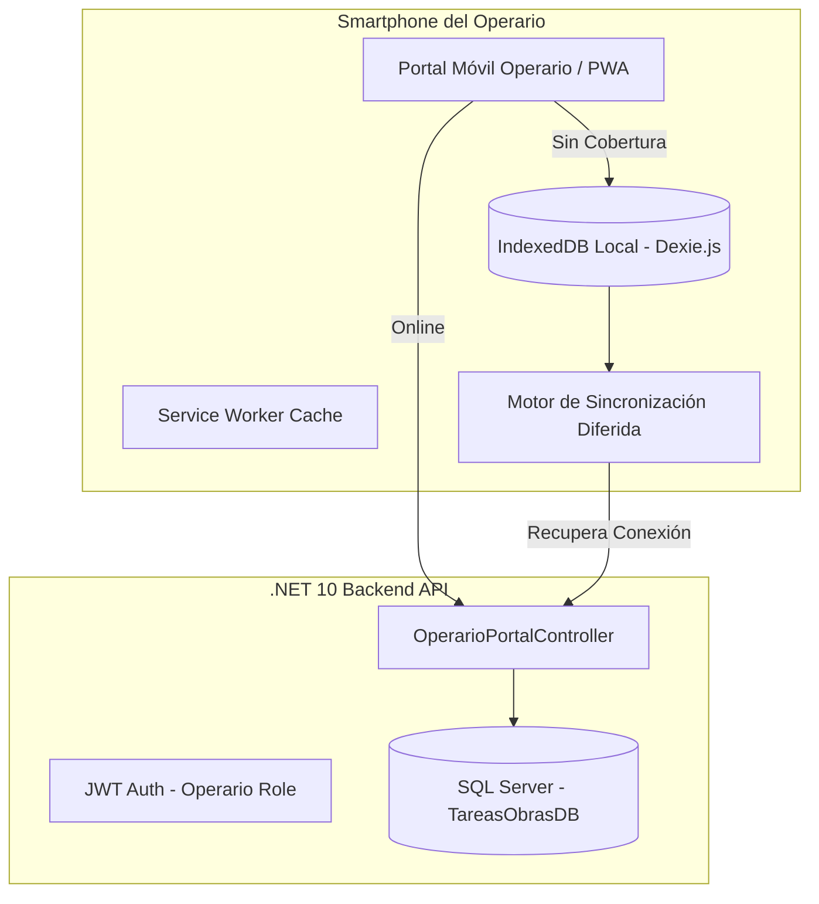

# Plan de Implementación: PWA para Registro de Horas y Fichaje de Operarios

## 1. Visión y Objetivo
Proporcionar a los operarios en obra una interfaz móvil rápida, ligera y accesible directamente desde sus smartphones para:
1. **Fichar Entrada / Salida** de jornada con 1 solo toque.
2. **Registrar horas y tareas** realizadas en las obras asignadas.
3. **Operar sin conexión a internet (Offline-First)** en zonas con escasa cobertura (sótanos, zonas rurales, etc.) con sincronización automática diferida.
4. **Geolocalización opcional** para certificar el control de presencia en la ubicación de la obra.

---

## 2. Comparativa Técnica y Decisión de Arquitectura

| Criterio | Opción A: **PWA (Seleccionada)** | Opción B: **Capacitor (Híbrida)** | Opción C: **Flutter / React Native** |
| :--- | :--- | :--- | :--- |
| **Tecnología** | Angular 20 + `@angular/pwa` | Angular 20 + `@capacitor/core` | Dart / Flutter o React Native |
| **Código reutilizado** | **100%** del proyecto Angular existente | **95%** (mismo Angular empaquetado) | **0%** (proyecto separado desde cero) |
| **Instalación** | Directa desde el navegador ("Añadir a pantalla de inicio") | Archivo `.apk` o tiendas oficiales | Tiendas oficiales (Google Play / App Store) |
| **Costes y Licencias** | **0 €** (sin tarifas de desarrollador) | 99$/año Apple + 25$ Google si va a tiendas | 99$/año Apple + 25$ Google |
| **Soporte Offline** | ✅ Completo (Service Workers + IndexedDB) | ✅ Completo (IndexedDB / SQLite) | ✅ Completo (SQLite / Hive) |
| **Geolocalización** | ✅ API estándar `navigator.geolocation` | ✅ Plugin `@capacitor/geolocation` | ✅ Librerías nativas del SO |
| **Tiempo estimado** | ⚡ **1 - 2 semanas** | ⏱️ 2 - 3 semanas | ⏱️ 6 - 8 semanas |

> **Decisión:** Desarrollar como **PWA Mobile-First** dentro del proyecto Angular 20 actual. Si en el futuro se requiere publicar en Google Play o Apple App Store, la PWA se puede empaquetar con Capacitor o PWABuilder sin reescribir código.

---

## 3. Arquitectura del Sistema



---

## 4. Requisitos y Diseño Mobile-First

### 4.1. Experiencia de Usuario (UX)
* **Diseño táctil:** Botones grandes aptos para uso en obra (guantes, exteriores).
* **Navegación minimalista:** Sin el menú lateral de administración de oficina; barra de navegación inferior móvil (*bottom bar*) con 3 secciones:
  1. **Fichar:** Botón principal de entrada/salida y resumen de hoy.
  2. **Mis Horas:** Historial semanal y desglose por obra.
  3. **Perfil:** Datos del operario, estado de conexión y cierre de sesión.
* **Indicador de Sincronización:**
  * 🟢 *Todo sincronizado con el servidor*
  * 🟡 *X fichajes guardados localmente pendientes de enviar*

### 4.2. Control de Presencia y Geolocalización
* Al presionar "Fichar Entrada" o "Fichar Salida", se consulta `navigator.geolocation.getCurrentPosition()`.
* Se envían y persisten las coordenadas (latitud/longitud) para validación de presencia en la obra.

---

## 5. Cambios en Backend (.NET 10)

### 5.1. Vinculación `AppUser` ⟷ `Operario`
* Añadir `public string? UserId { get; set; }` a la entidad `Operario` (o campo `OperarioId` en `AppUser`).
* En el login, emitir en el JWT el claim `operario_id` para identificar al trabajador automáticamente en cada petición.

### 5.2. Extensión de `RegistroHoras`
* Incorporar campos opcionales para control horario y geolocalización:
  * `decimal? LatitudInicio`, `decimal? LongitudInicio`
  * `decimal? LatitudFin`, `decimal? LongitudFin`
  * `bool SincronizadoOffline`
  * `DateTime? TimestampDispositivo` (para registrar la hora real del fichaje aunque se sincronice horas más tarde).

### 5.3. Nuevo Controlador: `OperarioPortalController`
* `GET /api/operario/me`: Devuelve datos del operario logueado y lista de obras activas asignadas.
* `GET /api/operario/jornada-hoy`: Estado actual de la jornada (fichado, hora inicio, horas acumuladas hoy).
* `POST /api/operario/fichar-entrada`: Registra inicio de jornada con obra seleccionada y GPS.
* `POST /api/operario/fichar-salida`: Registra fin de jornada y calcula horas.
* `POST /api/operario/sincronizar-batch`: Endpoint que recibe un listado de fichajes guardados offline durante cortes de red y los procesa en bloque.

---

## 6. Cambios en Frontend (Angular 20)

### 6.1. Habilitación de PWA
```bash
cd TareasObras_v2_frontend
ng add @angular/pwa --project tareas-obras
```
* **`manifest.webmanifest`:**
  * `name`: *TareasObras - Portal Operarios*
  * `short_name`: *TareasObras*
  * `theme_color`: `#0f172a` (o color corporativo)
  * `background_color`: `#ffffff`
  * `display`: `standalone` (oculta la barra de direcciones del navegador, parece app 100% nativa)
* **`ngsw-config.json`:**
  * Caché de recursos estáticos (HTML, JS, CSS, iconos).
  * Estrategia `freshness` para llamadas a `/api/operario/*` con fallback a caché/offline.

### 6.2. Motor de Almacenamiento Offline (Dexie.js)
```bash
npm install dexie
```
* Definir base de datos IndexedDB local:
  * `fichajesPendientes`: Cola de registros a sincronizar.
  * `obrasCache`: Lista de obras descargadas para poder elegir obra aun estando sin cobertura.
* Servicio `OfflineSyncService`:
  * Detecta `window.addEventListener('online')` y reintenta el vaciado de la cola automáticamente.

### 6.3. Nueva Ruta y Módulo: `/portal-operario`
* Diseñado con componentes standalone y layout móvil independiente (`mobile-shell.component.ts`).
* Guardián de rutas (`OperarioGuard`): Redirige usuarios con rol `Operario` directamente a `/portal-operario`.

---

## 7. Fases de Ejecución

- [ ] **Fase 1: Backend (.NET 10)**
  - [ ] Relación `AppUser` y `Operario`.
  - [ ] Migración de base de datos con nuevos campos de geolocalización y timestamps en `RegistroHoras`.
  - [ ] Endpoints de `OperarioPortalController` (Entrada, Salida, Jornada de Hoy, Sincronización Batch).
- [ ] **Fase 2: Configuración PWA**
  - [ ] Instalación de `@angular/pwa`.
  - [ ] Iconos PWA (192x192, 512x512) y configuración de `manifest.webmanifest`.
  - [ ] Políticas de caché en `ngsw-config.json`.
- [ ] **Fase 3: Interfaz Móvil del Operario**
  - [ ] Layout móvil con bottom-bar accesible.
  - [ ] Botón de fichaje grande con feedback visual y háptico.
  - [ ] Captura de geolocalización en navegador.
- [ ] **Fase 4: Resiliencia Offline**
  - [ ] Creación del almacén local con Dexie.js.
  - [ ] Cola de peticiones diferidas y sincronización en reconexión.
- [ ] **Fase 5: Pruebas de Campo**
  - [ ] Instalación en dispositivo físico Android y iPhone.
  - [ ] Simulación de modo avión en obra y validación de sincronización.
